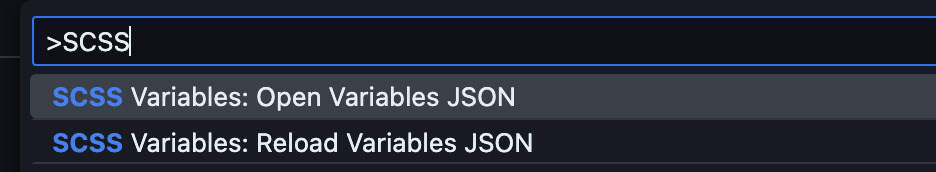

# SCSS Variables Completion


A Visual Studio Code extension that provides intelligent autocompletion for CSS custom properties (CSS variables) in SCSS files. The extension reads variable definitions from a JSON configuration file and provides real-time completion suggestions with documentation.

## Features

- Autocompletion for CSS custom properties in .scss and .module.scss files
- Variable documentation with values and descriptions
- Live reload when the variables JSON file changes
- Commands to manually reload and open the variables JSON file

## Requirements

- Visual Studio Code version 1.83.0 or higher
- A JSON file containing your CSS variable definitions

## Installation

1. Install the extension through VS Code's extension marketplace
2. Create a `scssVariables.json` file in your workspace root (or configure a custom path)

## Configuration

This extension contributes the following settings:

- `scssVariables.path`: Path to the JSON file containing SCSS variable definitions (default: "scssVariables.json")


## JSON File Format

Create a JSON file with the following structure:

```json
{
  "border-radius-large": {
    "value": "8px",
    "description": "Large border radius for components"
  },
  "color-primary": {
    "value": "#ff0000",
    "description": "Primary brand color"
  }
}
```

## Usage

1. In your SCSS files, type `var(--` to trigger autocompletion
2. Select a variable from the completion list to insert it
3. Variables can be filtered by typing partial names
4. Hover over completions to see values and descriptions

## Commands

- SCSS Variables: Reload Variables JSON : Manually reload the variables from the JSON file
- SCSS Variables: Open Variables JSON : Open the variables JSON file for editing



## Extension Settings

- `scssVariables.path` : Set the path to your variables JSON file relative to the workspace root
