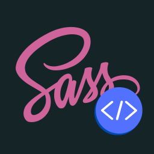

# SCSS Variables Completion



---
A Visual Studio Code extension that enhances your SCSS and CSS workflow with intelligent autocompletion, diagnostics, and hover information for CSS custom properties and SCSS variables.

## Overview

SCSS Variables Completion helps you manage design tokens by providing intelligent suggestions based on your CSS properties and variable names. Define your variables in a JSON file, and the extension provides contextual suggestions, diagnostics, and detailed hover information across your workspace.

## Key Features

🔍 Smart Variable Completion

- Context-aware suggestions based on CSS properties (shows only color variables for color: properties)
- Fuzzy matching for variable names
- Live color previews in completion dropdown
- Labels variables as `[Design System]` (from JSON) or `[Local]` (from workspace)

🔎 Detailed Hover Information

- View descriptions, values, and source information when hovering over variables
- Direct links to jump to local variable definitions
- Theme and variant awareness for multi-valued variables

⚠️ Diagnostics

- Warnings for undefined variables
- Highlighting of variables used with unsupported CSS properties
- Detection of local variables not included in your design system JSON
- Identification of unused JSON variables with exact line numbers

🔍 Workspace Scanning

- Deep scanning of workspace for SCSS, module.scss, and CSS files
- Configurable excluded folders and maximum scan depth
- Automatic detection of local variables, mixins, and functions
- File change monitoring with debounced re-scanning
- Progress notifications during workspace scanning
- Cancellable scanning operations
- Batch processing for better performance
- Parallel scanning support for large workspaces

📊 Variables Overview

- Visual panel showing all available variables
- Filtering by variable type and source
- Highlighting of local variables not included in your design system JSON

🛠️ Performance

- Trie-based prefix matching for fast variable lookups
- Configurable workspace scanning settings
- Debounced file change handling to prevent excessive re-scanning
- Batch processing of files to prevent memory issues
- Parallel scanning for faster processing in large workspaces
- File system caching for faster subsequent scans
- Automatic skipping of large files and common build/output directories
- Configurable batch sizes and delays for optimal performance
- Comprehensive exclusion patterns for build artifacts and dependencies

## Variable Overview Panel

The extension provides a comprehensive overview of all SCSS variables in your workspace through the "SCSS Variables Overview" panel. This panel shows:

- Design System Variables: Variables defined in your design system JSON files
- Local Variables: Variables found in your SCSS files
- Variable Statistics: Shows both total and unique variable counts
- Variable Details: For each variable, you can see:
  - Name and value
  - File location
  - Line number
  - Color preview (for color variables)
  - Usage count
  - Whether it's also defined in the design system

To open the overview panel:

1. Press `Ctrl+Shift+P` (Windows/Linux) or `Cmd+Shift+P` (Mac)
2. Type "SCSS Variables Overview"
3. Select the command to open the panel

## Variable Counting

The extension tracks two types of variable counts:

1. **Total Variables**: The total number of variable definitions found in your SCSS files
2. **Unique Variables**: The number of unique variable names (deduplicated by name)

This helps you understand:

- How many times each variable is defined
- Where variables are being redefined
- Potential naming conflicts
- The overall size of your variable system

For example, if you see "Local Variables: 1764 (496 unique)", this means:

- There are 1764 total variable definitions
- These definitions use 496 unique variable names
- Some variables are defined multiple times in different files

## Installation

1. Install from the VS Code Marketplace
2. Create or place a `scssVariables.json` file in your workspace root (or configure a custom path)
3. Start using variables in your SCSS/CSS files

## Configuration

Configure through VS Code settings (`settings.json`):

```json
{
  "scssVariables.path": "styles/scssVariables.json",
  "scssVariables.logLevel": "info",
  "scssVariables.excludedFolders": ["node_modules", "dist", "build"],
  "scssVariables.scanPaths": ["src/styles", "components/**/*.scss"],
  "scssVariables.maxScanDepth": 30,
  "scssVariables.enableDiagnostics": true,
  "scssVariables.showLocalVariableNotifications": false,
  "scssVariables.showScanProgress": true,
  "scssVariables.maxFilesPerBatch": 1000,
  "scssVariables.batchScanDelay": 100,
  "scssVariables.enableParallelScanning": true,
  "scssVariables.maxParallelScans": 4,
  "scssVariables.enableFileSystemCaching": true,
  "scssVariables.maxFileSize": 1048576,
  "scssVariables.additionalExcludePatterns": [
    "**/node_modules/**",
    "**/dist/**",
    "**/build/**",
    "**/.git/**",
    "**/coverage/**",
    "**/target/**",
    "**/out/**",
    "**/bin/**",
    "**/obj/**",
    "**/tmp/**",
    "**/temp/**",
    "**/vendor/**",
    "**/venv/**",
    "**/.env/**",
    "**/__pycache__/**",
    "**/.pytest_cache/**",
    "**/.mvn/**",
    "**/.gradle/**",
    "**/.idea/**",
    "**/.vscode/**"
  ]
}
```

### Settings Options

| Setting | Description | Default |
| --- | --- | --- |
| scssVariables.path | Path to your JSON variables file | "scssVariables.json" |
| scssVariables.logLevel | Logging detail level (error, warn, info, debug) | "info" |
| scssVariables.excludedFolders | Folders to skip during scanning | ["node_modules", "dist", "build"] |
| scssVariables.scanPaths | Specific paths/globs to scan (empty = scan all) | [] |
| scssVariables.maxScanDepth | Maximum folder depth for scanning | 30 |
| scssVariables.enableDiagnostics | Enable/disable diagnostic warnings | true |
| scssVariables.showLocalVariableNotifications | Show notifications for new local variables | false |
| scssVariables.showScanProgress | Show progress notifications when scanning | true |
| scssVariables.maxFilesPerBatch | Maximum number of files to process in a single batch | 1000 |
| scssVariables.batchScanDelay | Delay between batch processing in milliseconds | 100 |
| scssVariables.enableParallelScanning | Enable parallel file processing | true |
| scssVariables.maxParallelScans | Maximum number of parallel scan operations | 4 |
| scssVariables.enableFileSystemCaching | Enable caching of scan results | true |
| scssVariables.maxFileSize | Maximum file size to scan in bytes (files larger will be skipped) | 1048576 (1MB) |
| scssVariables.additionalExcludePatterns | Additional glob patterns for excluding files/directories | See default above |

## JSON Schema

Define your design tokens in a JSON file using this format:

```json
{
  "variable-1-bg-color": { // [USED]: actual variable that will be used
    "value": { // [NOT USED]: just for users to see the values
      "dark": " #292e3d",
      "light": " #ffffff"
    },
    "description": "Background/Surface color", // [NOT USED]: just for users to see the description
    "cssAttributesSupported": [ // [USED]: to show suggestions
      "background-color"
    ]
  },
  "variable-2-btn-padding-sm": {
    "value": {
      "small": "4px",
      "medium": "6px",
      "large": "8px"
    },
    "description": "Button padding (small)",
    "cssAttributesSupported": [
      "padding",
      "padding-top",
      "padding-right",
      "padding-bottom",
      "padding-left",
      "margin",
      "margin-top",
      "margin-right",
      "margin-bottom",
      "margin-left"
    ]
  }
}
```

### JSON Properties

- `value`: A string or an object with theme/variant options
- `description`: A description of the variable's purpose (shown in hover)
- `cssAttributesSupported`: Array of CSS properties where this variable is valid

## Commands

Access these commands from the Command Palette (`Ctrl+Shift+P` or `Cmd+Shift+P`):

- **SCSS Variables: Refresh Variables** - Reloads JSON and rescans workspace
- **SCSS Variables: Open Configuration File** - Opens your JSON variables file
- **SCSS Variables: Show Variables Overview** - Displays a table of all variables
- **SCSS Variables: Validate JSON Configuration** - Validates your JSON against the schema
- **SCSS Variables: Check Unused JSON Variables** - Reports unused variables defined in JSON

## Usage Tips

- Type `var(--` to trigger auto-completion, or use `Ctrl+Space` after `var(`
- Check the Problems panel for warnings about variable usage
- Use the Variables Overview panel to see all available variables at a glance
- Configure excluded folders and additionalExcludePatterns to improve scanning performance in large projects
- Set specific scanPaths to focus on relevant directories
- Adjust maxFilesPerBatch and batchScanDelay for optimal performance in your workspace
- Enable parallelScanning for faster processing in large monorepos
- Use fileSystemCaching to speed up subsequent scans
- Set maxFileSize to skip processing of large files
- Monitor scan performance and adjust settings based on your workspace size
- Watch the progress notification during workspace scanning
- You can cancel a scan in progress if needed

## Troubleshooting

If you encounter issues:

1. Verify your JSON file matches the expected schema
2. Check the SCSS Variables output channel for detailed logs
3. Adjust the logLevel setting to "debug" for more information
4. Use the "Refresh Variables" command to force a rescan
5. Ensure your workspace doesn't exceed the maxScanDepth setting
6. If scanning is slow, try adjusting the performance settings:
   - Reduce maxFilesPerBatch if memory usage is high
   - Increase batchScanDelay if CPU usage is high
   - Disable parallelScanning if experiencing stability issues
   - Adjust maxFileSize to skip large files
   - Add more patterns to additionalExcludePatterns

## License

[MIT](./LICENSE)
