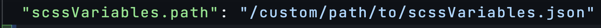

# SCSS Variables Completion


SCSS Variables Completion is a Visual Studio Code extension that provides intelligent autocompletion for CSS custom properties (CSS variables) in SCSS files. It supports two modes for sourcing variable definitions: a JSON configuration file or direct parsing of SCSS theme files. Enjoy live filtering with fuzzy matching, sorting, and even preview your variables in a WebView.

## Features

- Autocompletion: Provides intelligent suggestions for CSS custom properties in .scss and .module.scss files.
- Advanced Filtering: Multi-keyword search with fuzzy matching; completions are sorted alphabetically.
- Dual Data Source:
  - JSON Mode: Read variable definitions from a JSON file with detailed documentation.
  - SCSS Mode: Parse two SCSS theme files (e.g., theme-dark.scss and theme-light.scss) and merge overlapping variables. Variables that appear in both themes display combined information.
- Live Reload: Automatically reloads variables when the source file(s) change.
- Command Palette Enhancements:
  - Reload Variables: Manually reload the variables.
  - Open Variables File: Open your variables file for editing.
  - Preview All Variables: View a detailed table of all loaded variables in a WebView panel.
- Debug Logging: Detailed debug output available via the "SCSS Variables Completion" output channel.

## Requirements

- Visual Studio Code version 1.83.0 or higher.
- A JSON file with your CSS variable definitions (for JSON mode) or SCSS theme files (for SCSS mode).

## Installation

1. Install the extension from the VS Code Marketplace.
2. For JSON mode, create a scssVariables.json file in your workspace root (or configure a custom path).

## Configuration

This extension contributes the following settings:

- Data Source Mode
  - `scssVariables.source`: Select the source for variable definitions.
    - `"json"` (default): Read variables from a JSON file.
    - `"scss"`: Parse variables directly from SCSS theme files.
- JSON Mode Settings
  - `scssVariables.path`: Path to the JSON file containing SCSS variable definitions (default: "scssVariables.json").
- SCSS Mode Settings
  - `scssVariables.darkThemePath`: Path to the dark theme SCSS file (default: "theme-dark.scss").
  - `scssVariables.lightThemePath`: Path to the light theme SCSS file (default: "theme-light.scss").



## JSON File Format

When using JSON mode, create a JSON file with the following structure:

```json
{
  "variable-name": {
    "value": "variable-value",
    "description": "variable-description"
  }
}
```

Example:

```json
{
  "border-radius-large": {
    "value": "8px",
    "description": "Large border radius for components"
  },
  "color-primary": {
    "value": "#ff0000",
    "description": "Primary brand color"
  }
}
```

## Usage

1. In your SCSS files, type var(-- to trigger autocompletion.
2. As you type, the extension will filter suggestions using fuzzy matching. You can type multiple keywords to narrow down the list.
3. Hover over a completion item to view its value and description.
4. If using SCSS mode, overlapping variables from your dark and light theme files will be merged and displayed with combined descriptions.

## Commands

Access the following commands via the Command Palette (Ctrl+Shift+P or Cmd+Shift+P):

- SCSS Variables: Reload Variables
  Manually reload the variables from the configured source.
- SCSS Variables: Open Variables File
  Open the JSON or SCSS theme file for editing.
- SCSS Variables: Preview All Variables
  Open a WebView panel to preview all loaded variables in a tabular format.

## Debugging

For troubleshooting, check the "SCSS Variables Completion" output channel in VS Code (View > Output, then select the channel) to see detailed logs.

## Local Development and Testing

To test your extension locally:

1. Open your extension folder in VS Code.
2. Go to the Debug panel by clicking the Run and Debug icon on the Activity Bar (or press Ctrl+Shift+D / Cmd+Shift+D).
3. Select "Run Extension" from the dropdown in the Debug panel.
4. Press F5 to open a new Extension Development Host window with your extension loaded.
5. Test your features (autocomplete, commands, etc.) in the new window.

## License

[MIT](LICENSE)
